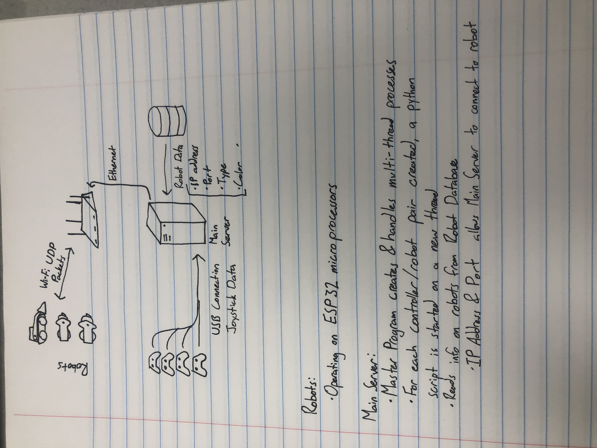

This is all the code needed to run the robots & arena at Robot City

The robots each have an ESP32 acting as a WiFi receiver. These can be reprogrammed wirelessly using the Arduino OTA protocol. Password is "1234". Code for the robots is found in the "Robot_ESP32" folder
Each robot will have the following programmed functionalities:
- The ability to send/receive packets over the WiFi network, used to drive the robots and toggle the killswitch. In the future, LED lights will be controlled in this manner as well
- Each robot can be reprogrammed when turned on and connected to the WiFi
- Each robot has an accelerometer, and will be able to invert drive controls when flipped upside down

A computer sitting under the arena will read inputs from the 4 controllers, and send the WiFi packets to each of the robots in the arena. This will be coded in python scripts
The computer will do the following:
- read inputs from each of the 4 controllers. They will be distinct from each other
- receive killswitch data. Manual input, also sensor from the door (possibly a ESP32 device that sends data over WiFi)
- translate the user inputs into packets for each robot. Send to robots via WiFi router. Measure ping with each robot
- Run a program with a screen for the employee and customers to watch. This program can:
  - Allow the employee can "scan" each robot before the match (assigning a robot to players 1-4)
  - Start the match, pause it. (Allow robots to drive to starting squares with weapons disabled). When employee hits start, bots are disabled during the "3, 2, 1..." countdown
  - Display a battle timer clock
  - Display points for each team, and a "winner" screen
  - Controls lights in arena
**At first, the UI will be text-based. In the future, it will be GUI & sensor-based

  
In the future, I will add a vpn capability to the computer, so I can repair things from anywhere, even uploading code to the robots.

**TIMELINE**
Pre 6/3/2025:
- ESP32 code: Connect to WiFi, Connect to & read data from gyroscope, establish "flipped over" protocol, collect Wi-Fi UDP packets, parse UDP data- validate and store values, create mixing function in junction with flipped value, mimic RC PWM values on GPIO pins as output values, establish killswitch behavior, enable wireless re-programming with Arduino OTP
- Main server: Connect to ESP32, send and receive UDP packets, read game controller values, fix stick drift behavior, constrain and map controller values- then send to ESP32 via UDP, establish killswitch "arming" trigger

6/3: Establish Failsafe behavior. Robots should not move when disconnected, but should attempt to reconnect. Safety protocol
6/4: Create SQL database. Stores values of each robot. Essential for being able to connect to many robots
6/5 - 6/6: Create handler program that creates & manages child programs. Each child program represents a pairing between a remote control and a robot. Each child program runs on its own thread
6/9: Create a python program that can manage the SQL db. Add robots, change active status, edit robots, etc.
6/10: Create a text-based UI to A) modify SQL db using aformentioned python program B) create and manage pairings between robots, and set the killswitch status by starting/pausing/ending games.
6/11: Create robot-monitoring function to A) measure latency between each connection B) Alert user if a robot becomes unresponsive
6/12: Optional: create Controller table in db to store callibration data (to correct stick drift individually) for each controller. Add handler functions and text UI 
6/13-16: test entire system using multiple ESP32s and controllers. Debug any problems 

